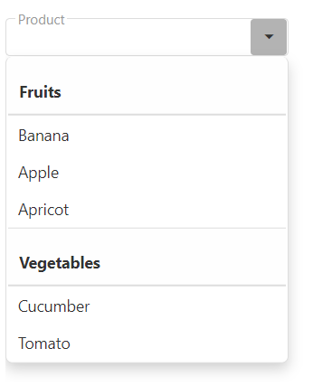

<!-- default badges list -->

<!-- default badges end -->
# DevExtreme SelectBox - Getting Started

This repository stores the code examples of the SelectBox component for the [Getting Started with SelectBox](https://js.devexpress.com/Documentation/Guide/UI_Components/SelectBox/Getting_Started_with_SelectBox/) tutorial. The created UI component has a populated drop-down list, allows users to search through it, and logs the previous and current selected items in the console.

## Files to Review

- **Angular**
    - [app.component.html](angular/src/app/app.component.html)
    - [app.component.ts](angular/src/app/app.component.ts)
- **jQuery**
    - [index.js](jquery/index.js)
- **React**
    - [App.js](react/src/App.js)
- **Vue**
    - [App.vue](vue/src/App.vue)

## Documentation

- [Getting Started with SelectBox](https://js.devexpress.com/Documentation/Guide/UI_Components/SelectBox/Getting_Started_with_SelectBox/)

- [SelectBox - API Reference](https://js.devexpress.com/Documentation/ApiReference/UI_Components/dxSelectBox/)
